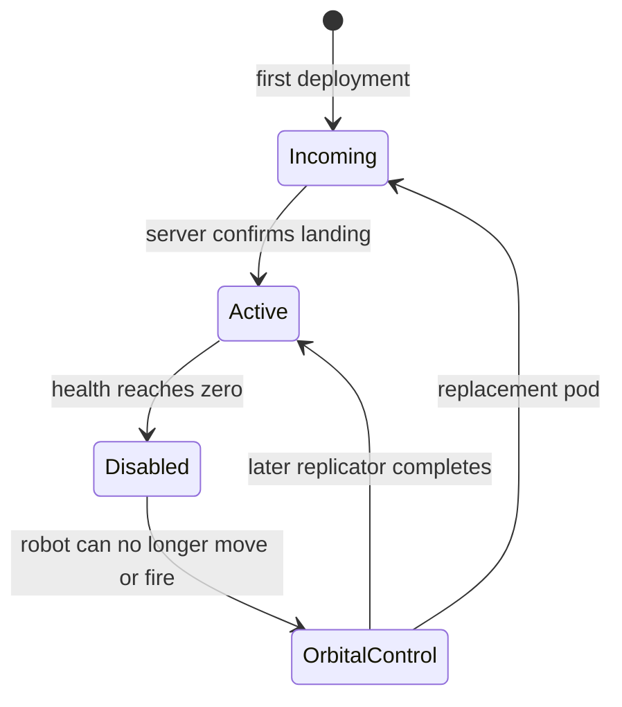

# Robot arrival and the first base

Design record, 2026-10-01. Requested after the shared turret work. This records
the intended robot, pod and base direction. Implementation is tracked separately
below; GAME_IDEAS.md remains the original vision.

Implementation follow-up: the first orbital survey, core landing, four unfolding
panels, provisional robot exit and persistent walkable flooring are now playable.
See [CORE_DEPLOYMENT.md](CORE_DEPLOYMENT.md) for exact implemented boundaries.
Personal survival and friendly-core selection are now implemented in
[SURVIVAL.md](SURVIVAL.md). Resource costs remain unimplemented design work.

## Confirmed follow-up: personal cores, shared recovery and unfolding panels

The user clarified the following design after the initial proposal. These rules
supersede the earlier suggestion that new teammates only use an existing core.

- Each player can have their own support core and operate independently. Core
  ownership and recovery access are separate: A and B can each choose to revive
  within the circular recovery area of either A's or B's friendly core.
- Establishing a core costs resources. Ordinary robot replacement uses an
  existing core's area and does not automatically deploy another core elsewhere.
  Initial allowances, prices, resource ownership and recovery radius remain open.
- Entry begins with a zoomed-out orbital survey, with a cloud presentation and
  terrain inspection, followed by landing-site selection and camera descent.
  The same overhead map can support both scales; a larger map comes later.
- The closed central block is 3 by 3 tiles: seven core cells, a sentry at the
  upper-right cell and a robot bay/exit at the middle-right cell.
- Each of its four sides unfolds a panel three tiles wide and four tiles long.
  The panels extend outside the central block: 4 * 3 * 4 = 48 panel tiles, plus
  9 central tiles = 57 affected tiles in an 11-by-11 bounding square. The four
  4-by-4 corner regions remain untouched.

```text
....PPP....
....PPP....
....PPP....
....PPP....
PPPPCCSPPPP
PPPPCCRPPPP
PPPPCCCPPPP
....PPP....
....PPP....
....PPP....
....PPP....
```

P = unfolded floor panel, C = core, S = sentry, R = robot bay/exit,
dot = terrain outside the footprint. Four tiles describes each panel's length
on the ground after unfolding, not additional isometric height.

The panels replace the covered terrain's appearance with flooring. Covered
obstacles such as rocks become walkable. Thus the panel art is decorative but
the deployed floor also changes traversal: collision/pathfinding must use the
same server-owned terrain/floor state that browsers display. This is an intended
feature, not something the current game's cosmetic craters already do.

Implementation recommendations, still proposals:

- Preview/reserve the full cross-shaped footprint, not all 121 cells of its
  bounding square. Check the centre, exit route and panels before taking payment.
  Natural rocks are convertible; existing structures, robots and another pending
  landing must not be overwritten. Start with land-only placement; covering water
  or creating floating bases is not settled by the rock-clearing instruction.
- Keep a persistent floor layer separate from core objects. Core machinery and
  the sentry remain obstacles; the robot bay/exit and outer panels are walkable.
  Apply floor conversion, core placement and resource spending atomically so
  reconnecting or simultaneous deployments cannot duplicate grants or charges.
- Let the player choose a friendly active core, highlight its recovery circle,
  and validate a clear landing point within it. The recovery circle need not
  match the floor footprint, and it does not confer invulnerability or ownership
  of every enclosed tile. Sharing recovery does not grant dismantling permission.
- Preserve laid flooring if a core is destroyed, but disable that core's recovery
  circle. This avoids rocks reappearing under units; destruction/cleanup behavior
  remains a proposal to review. Recovery after losing every core also remains open.

The next implementation should first prove one unfolding core, valid flooring
and exit, then core selection for recovery. No runtime changes are made by this
design record.

## Player identity and robot logic

The player is the orbital operator described in GAME_IDEAS.md. The robot is a
replaceable body, not the player's identity or the owner of the world's save.
Losing it should not erase buildings, territory or guest identity.

Suggested first loop:



- Active: WASD / touch movement, independent aim, deployment tool and health.
  The user's later weapon direction is a default liquid flamethrower and secondary
  laser rifle, replacing the earlier APCR suggestion. Aim-facing movement and
  directional strafing are recorded in [ROBOT_COMBAT_DESIGN.md](ROBOT_COMBAT_DESIGN.md).
  The playable robot now uses that fuel/laser loadout.
- Disabled: immediately stop accepted movement/fire; show a brief mechanical
  collapse and dim optics. No human gore is needed. The server owns this state.
- Orbital control: show the landing area and replacement countdown. Once facility
  control exists, allow it here, as the user originally requested. Do not make
  initial recovery depend on that future feature being finished.
- Recovery: begin with a short automatic replacement delay. The older draft's
  30-second orbital / 2-second replicator examples remain unsettled; test the
  recovery loop before fixing these times. A solo player with no facilities must
  always have a way to return. A replicator later provides faster local recovery.
- Returning alive: reconnect to the existing robot/location; reloading a page
  must not award a new starter package or force another full landing sequence.

## Landing in a pure overhead view

Use a short arrival inside the battlefield, approximately two seconds for the
robot pod. This is a proposed tuning target, not a long opening video.

| Beat | What the player sees | What communicates height or weight |
| --- | --- | --- |
| Incoming | A landing marker and broad, soft shadow; pod enters diagonally from the upper screen edge | The pod starts larger, as if closer to the overhead camera; a short hot trail gives direction |
| Final descent | Pod moves toward the marker and shrinks to its ground size | Shadow tightens/darkens, sprite and shadow converge, a short braking flare precedes impact |
| Impact | Pod stops sharply, a brief dust ring and a few outward fragments appear | Fast initial dust motion, restrained existing camera shake, later a heavy impact sound |
| Open | Split hatch panels, a momentary red optic light, robot steps clear | Stable ground shadow and a small scorch mark establish that the body has landed |

These are 2D sprite position, scale, shadow and timing changes. No isometric
terrain, camera tilt, 3D models or physical atmospheric simulation are needed.
Top-down robot optics should be a small readable cue, not a front-facing portrait.
The same technique can later deliver an artillery installation or cargo pod.

Dust should clear quickly enough to see threats. Reduced-effects mode removes
shake and most fragments but retains the landing marker, pod and hatch timing.
Impact effects are cosmetic initially: no friendly damage or enemy-clearing
blast. The confirmed panel deployment separately converts covered obstacles into
walkable flooring. Effects expire; no unlimited pod debris trail.

For multiplayer, one server landing event identifies the pod, landing position,
start time and duration. Browsers derive the animation from that state; they do
not synchronize individual dust particles. Reserve and revalidate a legal landing
footprint, then let the server activate the robot exactly once. Late joiners render
the appropriate progress, not a fresh landing. Duplicate/retried requests cannot
create duplicate robots, bases or equipment. Empty-world timing should follow
the game's pause policy. The later user clarification calls for choosing a legal
site from the orbital survey; arbitrary ocean drops and floating bases remain
future work.

## What arrives with the first expedition

The latest layout places the robot bay and sentry inside the initial folding
support-core package. Bundling the initial services keeps entry quick and avoids
several mandatory construction chores before the player can fight. Replacement
robot pods use an existing core's recovery area rather than bringing another base.

| Payload | Initial purpose | Boundary |
| --- | --- | --- |
| Robot pod | One controllable body with a basic weapon and deployment tool | No free extra vehicle fleet |
| Support core / terrain-modifier pod | Orbital relay, construction access and an integrated small power source | Fold-out panels create walkable flooring; wiring and the power economy remain later proposals |
| Integrated sentry | Covers an approach from the upper-right central tile | Included with core deployment, not granted again with each robot replacement |

Revised proposed order: land the folded core package, unfold enough flooring to
clear the right-hand exit, and release the robot. Remaining visual settling can
finish during play. The initial island should give enough breathing room for
this; early attacks should follow the playable opening, not punish a spawn lock.

Keep the replicator as a later improvement. A dedicated generator can later
expand power capacity, and repair/resupply can gain visible facilities when
health, ammunition or a resource economy actually make them useful. The starter
core should not promise systems that the next prototype does not yet implement.

New teammates can establish their own cores and share recovery access with the
existing team. How an initial core is funded is not settled; repeated logins or
robot deaths must not create free cores. Saving a deployment and any initial
allowance must be atomic and idempotent. This describes a future room/world rule;
the current app still has one shared test world, not implemented host-owned rooms.
Existing user saves need an explicit compatible adoption path, never regeneration.

## Suggested next playable stage

1. Robot body states, health, alien attack tells and short recoverable death.
2. One in-world robot-pod arrival/replacement animation using those same states.
3. One unfolding support core with integrated sentry, walkable panels and shared
   recovery-area selection, following the confirmed layout above.

Keep the first arrival and combat loop reviewable before adding logistics. Fuel,
gas, ships and aircraft remain later stages. The proposed robot loadout, starter
payload, recovery duration and base dependencies still need play/design review.
